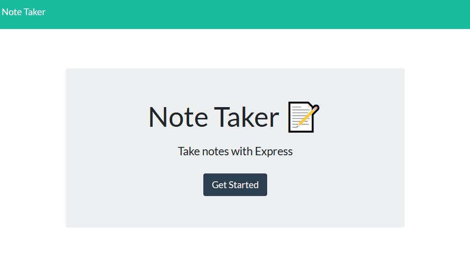
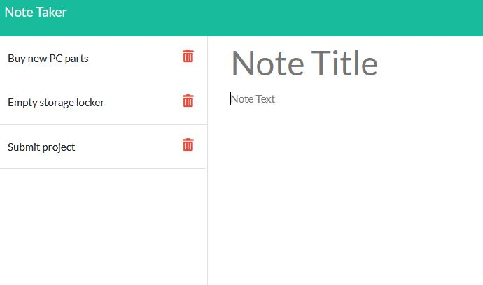

# Note Taker w/ Express.js


- [live site](https://sheltered-reaches-49948.herokuapp.com/)

## Description

A note taking app combining [nodeJS](https://nodejs.org/en/docs/), [ExpressJS](http://expressjs.com/) and [npm UUID](https://www.npmjs.com/package/uuid). Deployed on [Heroku](https://dashboard.heroku.com/apps)

Given an existing code base, this project aim was to incorporate a node backend, using GET, POST and DELETE requests to a server.



### My motivations

Experimenting more with node backend development, and learning to use Express, and understanding the basics of CRUD development. First time deploying with Heroku as well.

### What problem does it solve?

Replaces localStorage with something better and more robust.

### What I learned

CRUD development and how routing works, as well as using the [POSTMAN app](https://www.postman.com/) during development for testing all the api endpoints.

## Preview



## Table of Contents

- [Installation](#installation)
- [Usage](#usage)
- [Credits](#credits)
- [License](#license)
- [Questions](#questions)

## Installation

If you'd like play around with the code yourself:

1. Download the code to your own local machine and open up in a terminal of your choice (like VS code).

2. Open terminal, and run

```
npm install
```

3. Once all the missing node packages are installed, you're good to go.

```
NOTE: If nodeJS is not installed on your machine, download at nodejs.org
```

## Usage

Simply visit the live deployment and start using the app.

## Credits

- [npm UUID](https://www.npmjs.com/package/uuid)
- [POSTMAN app](https://www.postman.com/)
- [John Smilga's Node Tutorial on youtube](https://www.youtube.com/watch?v=Oe421EPjeBE&t=1s)

## License

[](https://choosealicense.com/licenses/mit/)

For more information about the licensing of this project, please click on the badge above, or follow this link https://choosealicense.com/licenses/mit/

## How to Contribute

Fork, submit pull requests and star the project!

## Tests

You'll need POSTMAN or a similar program in order to easily test the api/notes endpoints for GET, POST and DELETE.

## Questions

How to get into contact with me?

[My Github Profile](https://github.com/Jon-Ledo)

Email : jonledo.code@gmail.com
